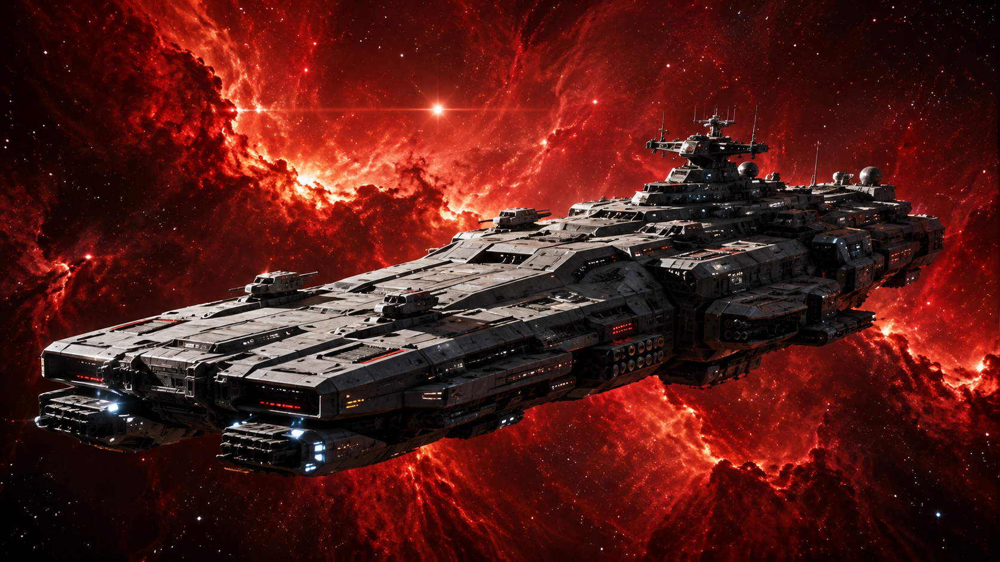

[:back: Back](readme.md)

---

# Weapons

Weapons are installed during ship construction.

Each weapon has a fixed **Component Mass**, **Superstructure requirement**, **Total Mass**, **Power Requirement**, **Damage**, and **Range**.

Weapons are purchased individually. They do not use the 1–6 component Rating table unless a weapon rule specifically says otherwise.

---

## Weapon Characteristics

| Characteristic     | Meaning                                           |
| ------------------ | ------------------------------------------------- |
| **Component Mass** | Mass of the weapon itself                         |
| **Superstructure** | Mass required to mount and support the weapon     |
| **Total Mass**     | Component Mass + Superstructure                   |
| **Power**          | Reactor Power required to fire the weapon once    |
| **Damage**         | Damage caused by a successful hit                 |
| **Range**          | Maximum range band at which the weapon may attack |
| **Arc**            | Facings from which the weapon may fire            |
| **Special**        | Additional rules that apply to the weapon         |

```text
Total Weapon Mass =
Component Mass + Superstructure
```

A weapon's Total Mass counts against the ship's Design Mass.

Power is paid when the weapon fires. Installing a weapon does not permanently reserve Reactor Power.

---

## Missiles

Missiles are long-range, self-propelled weapons that remain in play after launch.

Light, Medium, and Heavy missiles differ in speed, range, damage, launcher size, and magazine capacity. Light missiles are fast and numerous. Heavy missiles are slower, hit harder, and require substantially more space aboard ship.

Missile systems consist of two components:

* a **Missile Launcher** used to launch the weapon;
* a **Missile Magazine** used to store ammunition.

Missiles have their own Movement Point allocation and move across the battlespace after launch. They may also be intercepted by Point Defense before reaching their target.

See [Missiles](weapons/missiles.md) for Missile Launchers, Missile Magazines, missile performance, movement, ammunition, and damage.

---

## Weapon Mounts and Arcs

Each direct-fire weapon is assigned a firing arc when installed.

Use the ship's facings to record the mount.

Typical mounts are:

* Forward
* Aft
* Port
* Starboard

A weapon may normally attack only through its assigned firing arc.

Weapons listed with a **360°** Arc may attack through any facing.

Changing a weapon's mount after construction requires rebuilding the ship and does not occur during play.

---

## Power Requirements

Weapons draw Power from the Reactor when fired.

```text
Power Remaining =
Reactor Output
- Power allocated or spent on ship systems
```

A weapon may fire only if enough Power is available to pay its listed Power Requirement.

The ship's Reactor must still provide Power for propulsion, sensors, shields, and other active systems.

---

## Multiple Weapons

Each installed weapon is a separate component.

Installing multiple copies of a weapon requires paying the Component Mass and Superstructure cost for each weapon.

Each weapon also pays its Power Requirement separately when fired.

---

# Design Principle

Weapons compete for two resources:

**Mass during construction.**

**Power during combat.**

A ship may carry more weapons than it can fire at once.

That is intentional.

The weapon battery defines what the ship *can* do.

The Reactor and the captain's Power allocation determine what it *does* in a given round.
